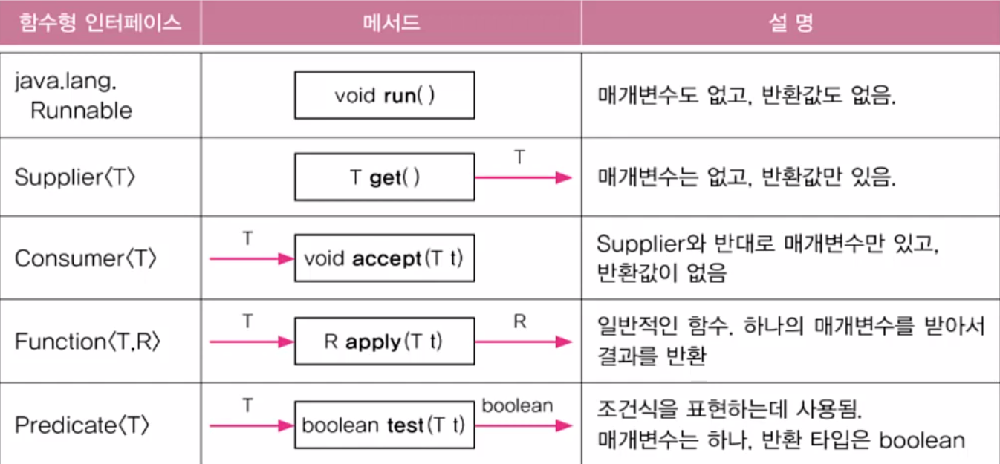
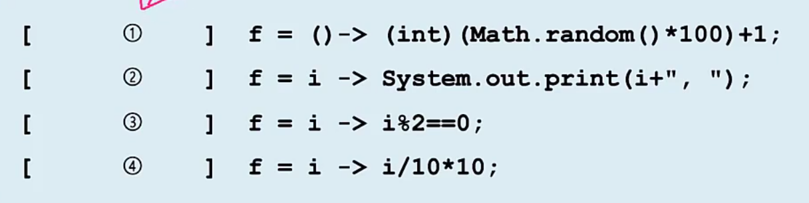
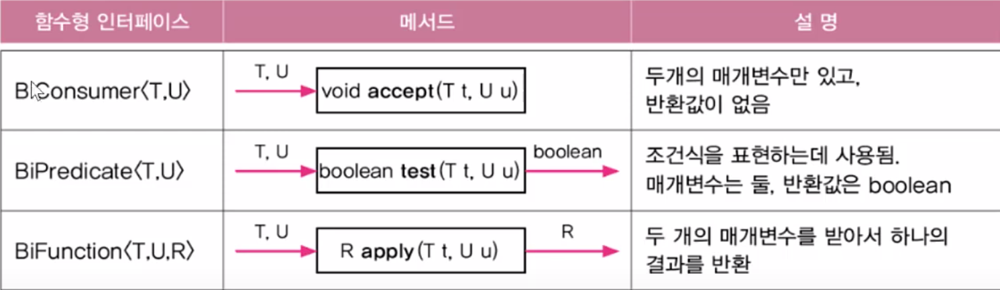
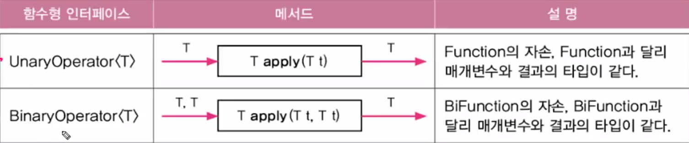

# Java
출처 : 자바의 정석

## 목차

14. [Rambda & Stream](#14-lambda--stream)
    - [람다식](#1-람다식--함수를-간단한-식으로-표현하는-방법-익명-함수)
    - [작성법](#2-람다식-작성하기)
    - [주의사항](#3-주의-사항)
    - [람다식 객체](#4-람다식)
    - [함수형 인터페이스](#5-함수형-인터페이스--단-하나의-추상-메서드만-선언된-인터페이스)
    - [함수형 인터페이스 반환타입](#6-함수형-인터페이스-타입의-매개변수-반환-타입)
    - [java.util.function package](#7-javautilfunction-package)
    - [function package Ex](#8-javautilfunction-예제)
    - [Predicate 결합](#9-predicate-결합)
    - [](#)


## 14. Lambda & Stream

#### 1. 람다식 : 함수를 간단한 식으로 표현하는 방법 (익명 함수)
```
int mmax(int a, int b) return a>b? a:b;
(a,b) -> a>b ? a: b
```

<br>

#### 2. 람다식 작성하기
 - 메서드의 이름과 반환타입을 제거하고 '->'를 { } 앞에 추가
 - 반환값이 있는 경우 식이나 값만 적고, return 문 생각 가능 (; 생략)
 - 매개 변수의 타입이 추론 가능하면 생략 가능  

<br>

#### 3. 주의 사항
 - 매개 변수가 하나인 경우 () 생략 가능
 - 블록 안의 문장이 하나뿐일 때, {} 생략 가능
 - 하나뿐인 문장이 return문인 경우에는 {} 생략 불가 (return을 적을 경우)
 - ex
   ```
   1. int max(int a, int b) return a>b? a:b;
   -> (a,b)-> a>b? a:b
   
   2. int printVar(String name, int i) System.out.println(name+"="+i)
   -> (name, i) -> System.out.println(name+"="+i)
   
   3. int square(int x) return x * x;
   -> x ->  x * x 
   
   4. int roll(){
      return (int) (Math.random()*6) ;
   } 
   -> ()-> (int) Math.random()*6)  
   ```   
   
<br>         

#### 4. 람다식
   - 람다식은 익명 클래스의 익명 객체
   - 람다식을 다루기 위한 참조 변수가 필요  

<br>
   
#### 5. 함수형 인터페이스 : 단 하나의 추상 메서드만 선언된 인터페이스
```
@FunctgionInterface
interface MyFunction {
   public abstract int max(int a, int b);
}

MyFunction f = new MyFunction(){
   public int max(int a, int b) return a>b ? a:b;
}

MyFunction f = (a,b) -> a>b? a:b;

int value = f.max(3,5)
```

<br>

#### 6. 함수형 인터페이스 타입의 매개변수, 반환 타입
   - 함수형 인터페이스 타입의 매개변수
     ```
     @FunctionalInterface
     interface MyFunction {
         void myMethod(); 
     }
     
     void aMethod(MyFunction f) {
         f.myMethod();
     }
     
     MyFunction f = () -> System.out.println("myMethod");
     aMethod(f);

     => aMethod(()->System.out.println("myMethod")); // 하나로 합치기
     ```
     
   - 함수형 인터페이스 타입의 반환 타입
     ```
      MyFunction myMethod() {
         MyFunction f = ()->{};
         return f;
      }
     
      MyFUnction myMethod(){
         return () -> {}
      }
      ```
<br>     

#### 7. java.util.function package
- 매개 변수가 1개인 함수형 인터페이스    

    

    ```
    Predicate<String> isEmptyStr = s-> s.length() == 0;
    String s = "";
    if(isEmptyStr.test(s) System.out.println("This is an empty String")
    ```
    
    
    
    ```
    1. Supplier<Integer> // input x , output o
    2. Consumer<Integer> // input o , output x 
    3. Predicate<Integer,Boolean // output boolean
    4. Function<Integer,Integer> // input o, output x
    ```
  
- 매개 변수가 2개인 함수형 인터페이스

    

    ```
    @FunctionalInterface
    interface TriFunction<T,U,V,R>{ // 매개 변수 3개
        R apply(T t, U, u, V, v);
    }
    ```
- 매개변수의 타입과 반환타입이 일치하는 함수형 인터페이스
  

#### 8. java.util.function 예제
- [Ex14_2](Java/src/main/java/Ex14_2.java)


#### 9. Predicate 결합
1. and(), or(), negate()로 두 Predicate를 하나로 결함(default method)
   ```
   Predicate<Integer> p = i -> i<100;
   Predicate<Integer> q = i -> i<200;
   Predicate<Integer> r = i%2 == 0;
   
   Predicate<Integer> notP = p.negate(); // i>=100
   Predicate<Integer> all = notP.and(q).or(r) // 100>=i && i<200 || i%2 ==0
   Predicate<Integer> all2 = notP.and(q.or(r)) // 100>=i && (i<200 || i%2 == 0)
   ```

2. 등가 비교를 위한 Predicate 작성은 isEqual() 사용(static)
    ```
    Predicatge<String> p = Predicate.isEqual(str);
    Boolean result = p.test(str2)
    ```
